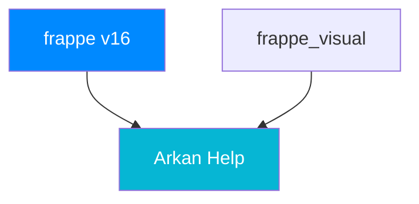

# Arkan Help — Dependency Graph
# أركان مساعدة — مخطط التبعيات

```mermaid
graph TD
    frappe["frappe v16"]
    frappe_visual["frappe_visual"]
    arkan_help["Arkan Help"]
    frappe --> arkan_help
    frappe_visual --> arkan_help
    style arkan_help fill:#06B6D4,color:#fff
    style frappe fill:#0089FF,color:#fff
```
