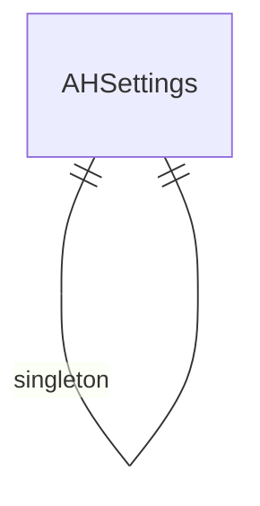

# Arkan Help — Entity Relationship Diagram
# أركان مساعدة — مخطط العلاقات

> 5 DocTypes

> **Note:** This is a placeholder ERD. Update with actual DocType relationships from the JSON definitions.
> Run: `ls arkan_help/arkan_help/*/doctype/` to discover all DocTypes and their Link fields.
