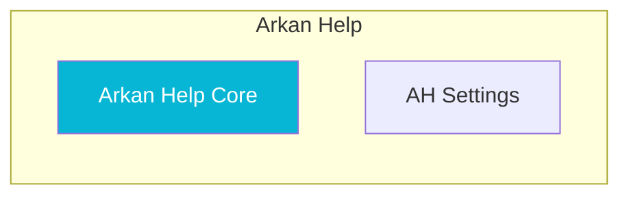

# Arkan Help — Module Map
# أركان مساعدة — خريطة الوحدات

```mermaid
graph LR
    subgraph Arkan Help
        Core["Arkan Help Core"]
        Settings["AH Settings"]
    end
    style Core fill:#06B6D4,color:#fff
```

> **Note:** This is a placeholder module map. Update with actual modules from `modules.txt`.
